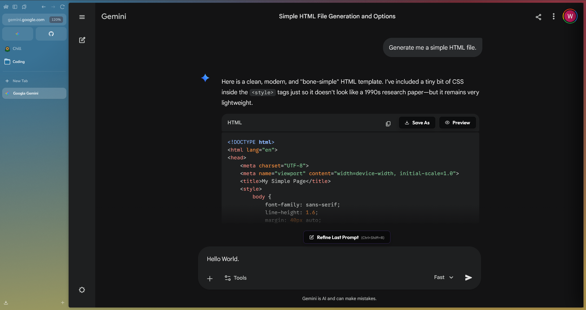
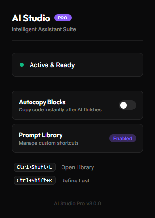
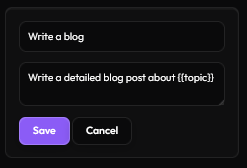

# AI Studio Pro

A developer toolset for ChatGPT and Gemini that adds code block management, live previews, and a localized prompt library.

## AI Declaration
Antigravity is my IDE of choice, providing advanced AI-powered coding capabilities.

## Showcase

## Usage

| Keybind | Action |
| --- | --- |
| `Ctrl+Shift+L` | Toggle Prompt Library |
| `Ctrl+Shift+R` | Refine the last prompt (Pastes your previous prompt back into the textbox for quick refining.) |
| `Ctrl+Shift+S` | Save the current code block |

## Dynamic Variables

Use `{{variable_name}}` anywhere in your custom prompt text. When selected, the extension will open a **movable glass modal** for you to fill in the placeholders before injection.

**Example:**
> "Rewrite this code in `{{language}}` focusing on `{{priority}}`."

## Local Setup

### Chrome
1. Open `chrome://extensions/`
2. Toggle **Developer mode**
3. Drag the `.crx` file onto the page or use `Load unpacked` on the `/chrome` directory.

### Firefox
1. Open `about:debugging`
2. Click **This Firefox**
3. Click `Load Temporary Add-on...` and select any file in the `/firefox` directory.

## License
MIT. See `LICENSE`.
